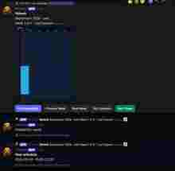

# Tempestivus

**Release:** v1.2.0

Tempestivus is an open-source Discord availability and attendance planner written in C++20. Members submit when they are available, and the bot turns those individual responses into weekly aggregate heatmaps that make it easy to see when a group actually overlaps.

The project is designed for gaming communities, clans, raids, tournaments, training sessions, community events, meetings, and any other group activity where several people need to find a common time.

Repository: https://github.com/TaoKais/Tempestivus

## What it does

- Monthly calendars split into correct Monday-based partial weeks
- Weekly PNG availability heatmaps rendered directly in Discord
- Configurable 15/30/60-minute scheduling core
- Same-participant overlap deduplication
- Aggregate participant counts per time slot
- `Previous Week` / `Next Week` navigation
- Private `My Schedule` view for each participant
- Conservative `Best Times` ranking for continuous event windows
- Owner-only daily attendee lookup
- `Attendees` button linked to the correct calendar automatically
- Calendar IDs displayed in the public calendar header
- Discord server nickname capture, with Discord username fallback
- Anonymous public scheduling with identity available privately to the calendar owner when required for coordination
- SQLite persistence with migrations, prepared statements, foreign keys, transactions, and indexes
- Cairo PNG rendering separated from Discord transport
- Debounced, thread-safe per-calendar render queue
- Persistent versioned component identifiers
- English and Spanish localization foundation
- Catch2 tests, Docker deployment, and GitHub Actions CI

## Screenshots

### Availability heatmap

Members submit availability and Tempestivus aggregates the result into a weekly heatmap. Public cells show counts such as `1/2` or `2/2`, not individual identities.


### My Schedule

Each member can privately inspect the availability they submitted without exposing it to the rest of the server.



### Attendee lookup

The calendar owner can privately query who is available on a selected day. Tempestivus uses the member's Discord server nickname when available and falls back to the Discord username.


## Privacy model

Tempestivus is aggregate-first by design.

The public calendar shows availability density and participant counts, but it does not need to expose who owns each time slot. Internal Discord user linkage is retained for deduplication, private schedule access, deletion, authorization, and organizer-only attendee lookup.

The owner-only attendee view is ephemeral. This gives organizers the information needed to coordinate an event while keeping the normal heatmap focused on aggregate availability.

## Architecture

Discord is an adapter around transport-neutral application services. Core scheduling logic is independent of DPP, Cairo, and SQLite.

See [architecture](docs/architecture.md), [database](docs/database.md), [privacy](docs/privacy.md), and [deployment](docs/deployment.md).

## Requirements

- CMake 3.24+
- C++20 compiler (GCC 13+ or Clang 16+ recommended)
- SQLite3 development package
- Cairo and pkg-config
- Git and network access during the first configure step

DPP and Catch2 are pinned through CMake `FetchContent`.

## Build from source

```sh
cmake -S . -B build -DCMAKE_BUILD_TYPE=Release
cmake --build build --config Release
ctest --test-dir build --output-on-failure
```

Copy `.env.example` to `.env`, fill the required values, and run the binary from an environment that loads those variables. `.env` is intentionally ignored and credentials must never be committed.

## Docker

```sh
cp .env.example .env
# Edit .env and set DISCORD_TOKEN and DISCORD_APPLICATION_ID.
docker compose up -d --build
docker compose logs -f horelac
```

SQLite is persisted at `/data/horelac.db` by the current container configuration. The runtime image runs as an unprivileged user.

The Docker build bundles the DPP shared library required by the bot runtime and runs `ldconfig` in the final image so `libdpp.so` can be resolved correctly.

GitHub hosts the source and CI; it does **not** keep the Discord bot running. Deploy the container on a VPS, Docker host, home server, cloud VM, or trusted container platform.

> Note: the public project name is now **Tempestivus**. Some internal binary, namespace, database, and Docker identifiers still use the historical `horelac` name and can be migrated independently without changing the public Discord workflow.

## Configuration

| Variable | Required | Default | Meaning |
|---|---:|---|---|
| `DISCORD_TOKEN` | yes | — | Bot token; never log or commit it |
| `DISCORD_APPLICATION_ID` | yes | — | Discord application snowflake |
| `DISCORD_DEV_GUILD_ID` | no | — | Register commands instantly in one development guild |
| `DATABASE_PATH` | no | `./data/horelac.db` | SQLite file path |
| `LOG_LEVEL` | no | `info` | Safe log verbosity |
| `DEFAULT_LOCALE` | no | `en` | Fallback UI locale |
| `RENDER_OUTPUT_DIR` | no | `./rendered` | Reserved fallback render directory |

Without `DISCORD_DEV_GUILD_ID`, commands register globally and may take longer to propagate.

## Discord Developer Portal setup

1. Create an application in the Discord Developer Portal.
2. Open **Bot**, create the bot, reset/copy its token, and store it only in `DISCORD_TOKEN`.
3. Copy the Application ID into `DISCORD_APPLICATION_ID`.
4. In the OAuth2 URL Generator select the `bot` and `applications.commands` scopes.
5. Select only the permissions the bot needs: View Channels, Send Messages, Embed Links, Attach Files, Read Message History, and Use Application Commands.
6. Open the generated URL and invite the bot to your server.

For a direct installation link, replace `YOUR_APPLICATION_ID`:

```text
https://discord.com/oauth2/authorize?client_id=YOUR_APPLICATION_ID&scope=bot%20applications.commands&permissions=2147601408
```

Review the permissions shown by Discord before authorizing. Do not grant Administrator.

## Commands

- `/schedule create` — creates a monthly calendar and posts its week-one heatmap.
- `/schedule add` — adds availability with `YYYY-MM-DD`, start time, and end time.
- `/schedule view` — renders a selected weekly aggregate as an ephemeral preview.
- `/schedule best duration:<minutes>` — ranks the best continuous aggregate windows.
- `/schedule attendees calendar:<id> date:<YYYY-MM-DD>` — privately lists members available on a given day; calendar owner only.
- `/schedule clear` — removes the caller's data from a calendar.

## Discord controls

Each durable public calendar message includes:

- **Add Availability** — opens a private modal for date, start time, and end time.
- **Previous Week** — navigates backward through the month.
- **Next Week** — navigates forward through the month.
- **My Schedule** — privately shows the requester's submitted intervals.
- **Best Times** — privately returns the strongest continuous overlap windows.
- **Attendees** — opens a date prompt and privately returns the members available that day to the calendar owner.

Availability submissions and private queries are ephemeral. The bot edits the existing public calendar instead of flooding the channel with a new heatmap after every change.

## Discord identity handling

When a member submits availability, Tempestivus stores the Discord user ID internally and records a display label for organizer-only lookup.

The preferred label is:

1. the member's **server nickname**;
2. otherwise their Discord username.

Older participant records may not have a stored nickname. Submitting or updating availability again refreshes the stored display name.

## Testing and CI

Tests cover partial and leap months, overlap deduplication, best-window ranking, invalid inputs, anonymous projections and rendering, private schedule isolation, daily attendee authorization, durable Discord message references, migrations, persistence, and cascading deletion.

DPP dependency tests are explicitly disabled in the Tempestivus build so project CI only evaluates Tempestivus-owned tests. CI is expected to fail on configuration, compilation, or project test failures.

## Contributing

Read [CONTRIBUTING.md](CONTRIBUTING.md). Keep domain code free of Discord types, use prepared SQL, add tests for behavior changes, and never commit credentials or database files.

## License

MIT. See [LICENSE](LICENSE).
